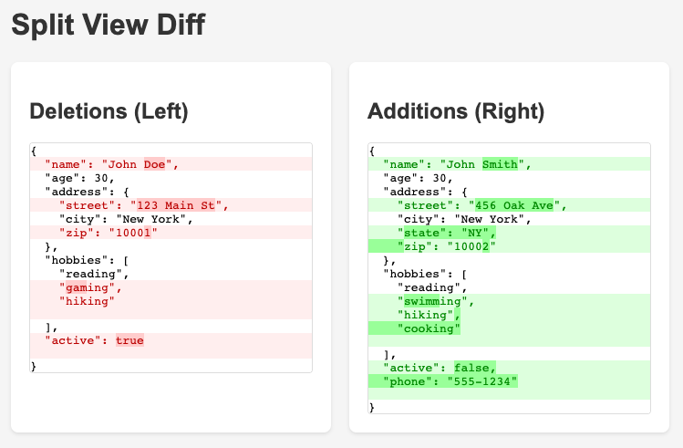

# Ruby Object Diff Demo

A proof-of-concept for generating beautiful HTML diffs between Ruby hashes and arrays using the [diffy](https://github.com/samg/diffy) gem.

## Split View Diff Example



## Overview

This demo shows how to:
- Convert Ruby objects (hashes, arrays) to nicely formatted JSON strings
- Generate visual diffs with character-level highlighting
- Create HTML output suitable for web display
- Support multiple diff formats (text, colored terminal, HTML)

## Examples

### Hash Diff
```ruby
hash1 = { name: "John Doe", age: 30, city: "New York" }
hash2 = { name: "John Smith", age: 30, city: "Boston" }
```

Produces a visual diff highlighting:
- Name change from "Doe" to "Smith" 
- City change from "New York" to "Boston"

### Array Diff
```ruby
array1 = [{ id: 1, status: "active" }, { id: 2, status: "pending" }]
array2 = [{ id: 1, status: "inactive" }, { id: 3, status: "active" }]
```

Shows additions, deletions, and modifications in array elements.

## Files

- `html_diff_poc.rb` - Main proof-of-concept script that generates HTML files
- `simple_diff_demo.rb` - Console demo showing different output formats
- `hash_diff.html` - Example HTML diff between two hashes
- `array_diff.html` - Example HTML diff between two arrays
- `split_diff.html` - Split view diff (deletions on left, additions on right)
- `diffy/` - Local copy of the diffy gem for reference

## Usage

### Basic Usage

```ruby
require 'json'
require 'diffy'

# Your Ruby objects
obj1 = { name: "Alice", skills: ["Ruby", "Python"] }
obj2 = { name: "Alice", skills: ["Ruby", "Python", "JavaScript"] }

# Convert to pretty JSON
str1 = JSON.pretty_generate(obj1)
str2 = JSON.pretty_generate(obj2)

# Create diff
diff = Diffy::Diff.new(str1, str2)

# Generate HTML
html_output = diff.to_s(:html)
```

### Running the Demos

1. Generate HTML diff files:
   ```bash
   ruby html_diff_poc.rb
   ```
   Then open `hash_diff.html`, `array_diff.html`, or `split_diff.html` in your browser.

2. See console output with different formats:
   ```bash
   ruby simple_diff_demo.rb
   ```

## Output Formats

### Text Format
```
 {
   "name": "Alice",
-  "age": 25,
+  "age": 26,
   "skills": [
     "Ruby",
-    "Python"
+    "Python",
+    "JavaScript"
   ]
 }
```

### HTML Format
- Red highlighting for deletions
- Green highlighting for additions
- Character-level diff highlighting within changed lines
- Clean, styled output with CSS

### Terminal Color Format
- ANSI colored output for command-line viewing
- Red for deletions, green for additions

## Integration Ideas

This approach could be integrated into:
- RSpec test output for better failure messages
- API response comparisons
- Configuration file change tracking
- Database record change visualization
- Git-style diff viewers for Ruby objects

## Requirements

- Ruby 2.0+
- diffy gem (included in this demo)
- JSON standard library

## License

This is a proof-of-concept demo. The diffy gem is copyright Sam Goldstein and contributors.
